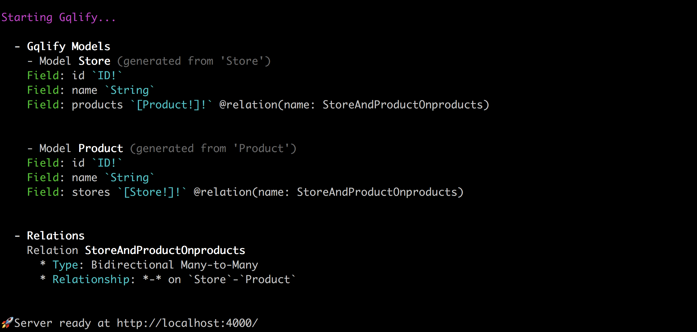

Many-to-Many relationships are another often used relationship. On the data-source level, it requires an additional association table which contains the primary key pairs of the associated entities.

A typical example for such a many-to-many relationship are `Product` and `Store`. Each `Store` sells multiple `Product` and each `Product` gets sold in multiple `Store`.


## Many-to-many
```graphql
type Store @GQLifyModel(dataSource: "memory", key: "users") {
  id: ID! @unique @autoGen
  name: String
  products: [Product!]!
}

type Product @GQLifyModel(dataSource: "memory", key: "books") {
  id: ID! @unique @autoGen
  name: String
  stores: [Store!]!
}
```

GQLify will create `many-to-many` relationship between `Store` and `Product`.



## Under the hood
The relationship join of `many-to-many` in GQLify relies on `ManyToManyRelation` interface of `DataSource`.

> Learn more from [Create own data-source](/docs/create-own-data-source) section
